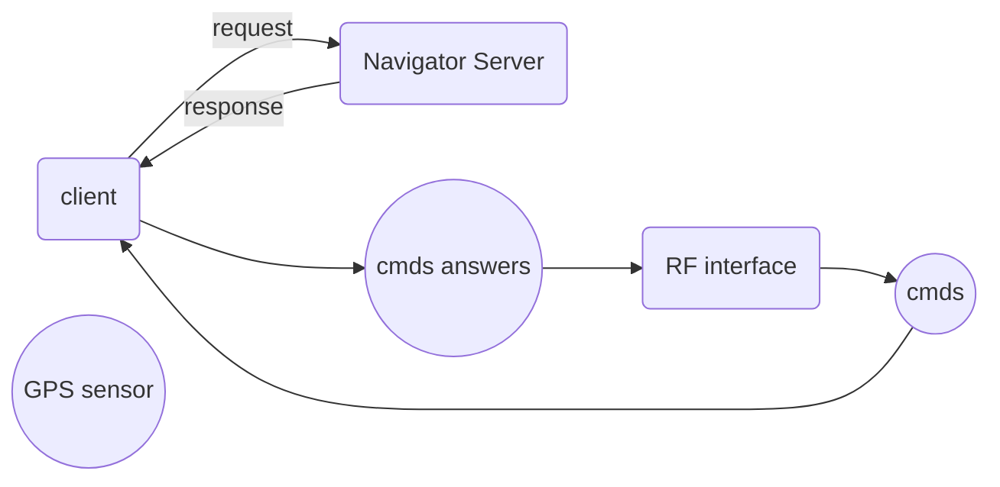

### Some notes about the thread safety of reading and writing to the `mavlink_connection`
We've tested this feature by creating two nodes, one in RPI and another in the GCS. In RPI we had 2 writer threads and each thread wrote on the serial port using `<message_name>_send` function. Even after commenting out the sleep coming after the send command, there were no error about multiple access to the serial port and I think this is becase this function are thread safe(If I see any problem about this I will inform you).
On the GCS node, we have two reader threads reading from the serial port by `recv_match` function. Running this node leads to exception which randomly occurs on one of the threads and says multiple access to the port. Even tested with one thread reading all the incoming datas and the other reading just one type and also each thread reading a different data type, the exception happened. So I can conclude that the reading from the serial port using `recv_match` is not thread safe.
### How the structure of data transmission can be?
on the GCS side, I think we can have one thread that just subscribes to the command topic and send them to the vehicle. for getting the responise in gui code or the code that sends the command, we should subscribe the command response topic and using a method like creating a table of sended commands, assign the subscribed responses the commands(maybe with a timeout!).
Also we have a reader thread which is the only accessor to the port for reading and reads the rf data to a list. on the other hand we have a publisher thread that reads from this input list and publishes messages to the proper topics.
__Note:__ We have tried to keep the reader worker function as small as possible(just reads and puts data into a list and not any data processing). This way (I think!) the chance of missing a byte or message tramsmitting over RF module, because of switching between the execution of threads by linux kernel, decreases(also consider that the 9XTend has internal buffer! but anyway this way can help even in the presense of this buffer). You can sense/understand this by comparing the case inwhich we have one thread reading and publishing data and the case inwhich we have two threads, one for reading data and another for publishing data(like the way we are using now). In future ... . Let's do the job!

In future I will ...
let's do the job.

### More detailed explanation about the Structures of sending the commands and receiving its response
After thinking about how we should send the commands to RPI and receive the responses from that(especially in RPI side code, because I've impelemented the GCS code without any detailed architecting but I think it is ok and just sends the commands sequentially and receives the responses and publishes them to a topic which is accessible by the GUI.), I came into 3 methods for doing this and we are going to document them:
- __Method 1:__ In the RPI side, we have 3 nodes, the navigator server, the client node managing the request and response to/from server node and a RF interface node. Also we have the sensor(e.g. GPS that here we don't consider this topic because it has not effect in complexity of architecture), command and command answer topics. In interface node we have a thread just reading and putting commands into a list(using a small seperated thread to prevent missing the inputs or commands). We also have another thread which publishes commands to the command topic or In simple words (as I know) saving the commands to the topic's buffer __sequentially__. Then in the client node, [[Think its callbacks execute sequentially for each command in the sequence of commands in the command topic(Also I think we should set the queue size to 1 for being sequential).]](Actually the queue size should be set into a proper value to prevent data missing. furthermore the I think event in the burst publishing the callbacks execute sequentially!). In the callback function of this subscriber we request for the proper service from the server node and this blocks the client node and no more callbacks are called till the response of the service by the client node. Then the callback publishes this answer to the command answer topic and a thread in the RF interface node listens to answers and invokes its callback in which the answer will be send to the GCS. __Note that all the process is sequential and commands are served in a queue!__ This is the ROS network for this setup:

- __Method 2:__ This method is actually a more compact version of method 1 and so this is also sequential in serving the commands. In the RF interface, there is a thread which reads and adds the commands to a command list or queue. Another thread reads the commands from the command list sequentially and handles the request and response with the navigator server. Then the answers will be written to the port of RF link by the same thread or another dedicated thread(I think a dedicated thread would be better, since if some problem happens on the RF connection the request/response handler thread blocks serving the other commands!).
__An important note that you should consider is that these ways of sending and receiving command and its response are not too reliable and you should consider some ways of checking the timeout for the commands to be more reliable. This feature will be added in future steps of the project and on demand!__
- __Method 3:__ For each command you can create a seperated thread to do the task of request and getting the response back. You can limit the number of threads to run concurrently(==You should consider this limitation in the number of threads also in the method 2 for long time taking commands.==), although I think the linux kernel does not have limitation in number of threads to handle(but too threads I think makes the concurrency pointless or too slow and I don't know exactly if too threads are problem or not, in future I will ...). I think this method can lead to some headaches in handling the concurrent commands that have conflict with each other. Also because we want have a consistent and predictable system behavior we need the synchronization so it finally leads to sequential process I think and consequently I do not prefer this way.

==I personally prefer the method 2, since it is simpler in structure and easier and faster for implementation of the project.== In future and on demand you can consider adding the feature of creating a new thread for specific commands that take long time to be handled. Also in the handler of each command type you can consider some conditions to prevent the conflicts in concurrent serving of commands. ==In comparision to method 3, I think this method will introduce less complexity by concurrency, since for example even for simple commands in method 3 you should consider the time sequence of commands(or synchronization) in order to have a consitent and predictable behavior. So I think this is overally a better method between these explained methods.==

So since the method 2 is more simpler(more compact than the method 1 and simpler structure that method 3) and well structured and is easier and faster to implement __We will use method 2 for doing the funnywing project!__
Let's do the job!

### Some links that can be important
- [ROS message filter package](http://wiki.ros.org/message_filters#Cache)
- [spinOnce equivalent in rospy or how to get only one message from the topic](https://answers.ros.org/question/110336/python-spin-once-equivalent/)
- [mavlink gps position message is scaled!](https://github.com/dronekit/dronekit-python/blob/master/dronekit/__init__.py#L900): Because the precision of float numbers are limited, mavlink multiplies the gps lat and lon by 1.0e7 to convert them to integers, and in decoding you should divide them by this scale factor. So you can have enough precision in lat and lon values.
- [For adding some automization in the invokation of proper mavlink function for sending a message type, somethings like writing a wraper can be helpful. This link can be helpful](https://stackoverflow.com/questions/817087/call-a-function-with-argument-list-in-python)
- [What we should set the mavlink command parameters that are empty?](https://discuss.bluerobotics.com/t/questions-about-mavlink-commands-and-the-pymavlink-documentation/11446): Based on this link, normally setting them to zero is ok. but the real answer is that the systems like autopilots using mavlink usually ignore this parameters and you can set them to any value, but you should be careful, since some systems may have extra features and use this empty parameters and in those cases you should refer to your specific system documentations!
- For creating a system to send and receive commands and their responses over RF link, you should consider a way of associating the responses to the proper requests(Actually I think it is needed for concurrent served commands). If you think about the funnywing project structure you will sense this need. I think you can use ==hash tables and `id` python function== for adding some identification to commands for recalling them later in receiving the command response.

So now let's do the job and construct the funnywing project.
Let's do the job!

